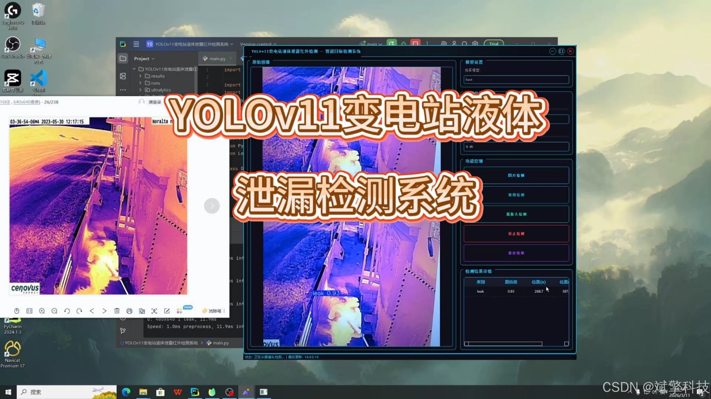
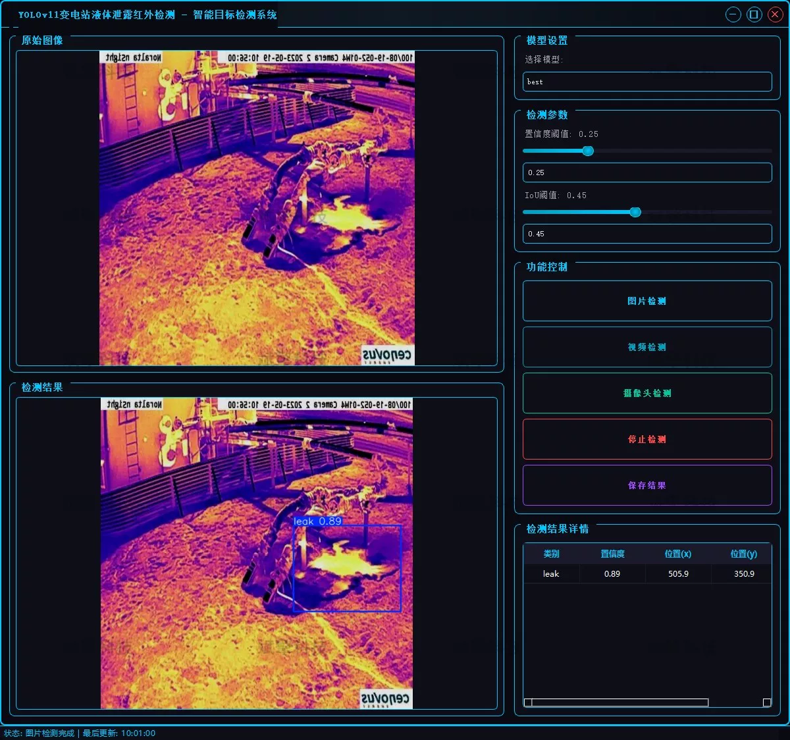
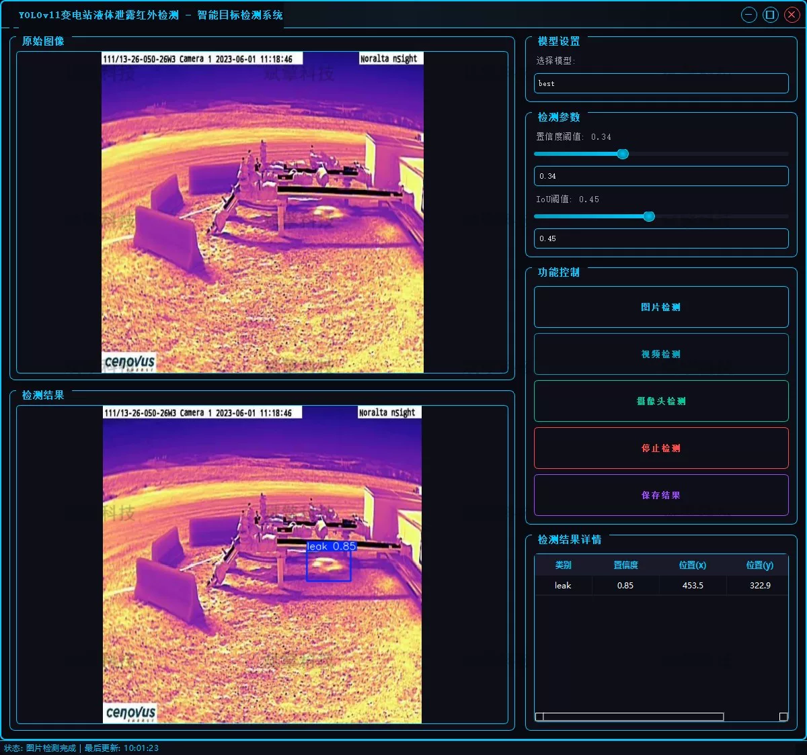
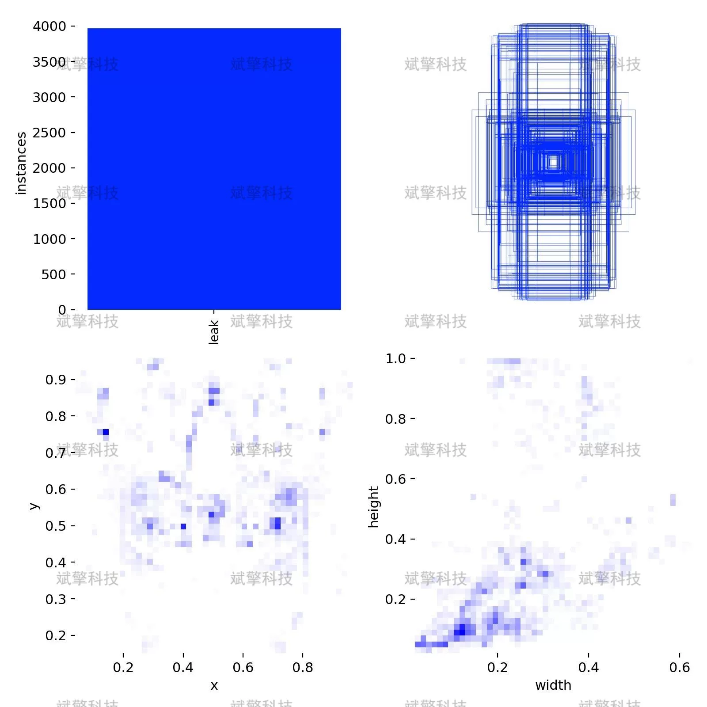
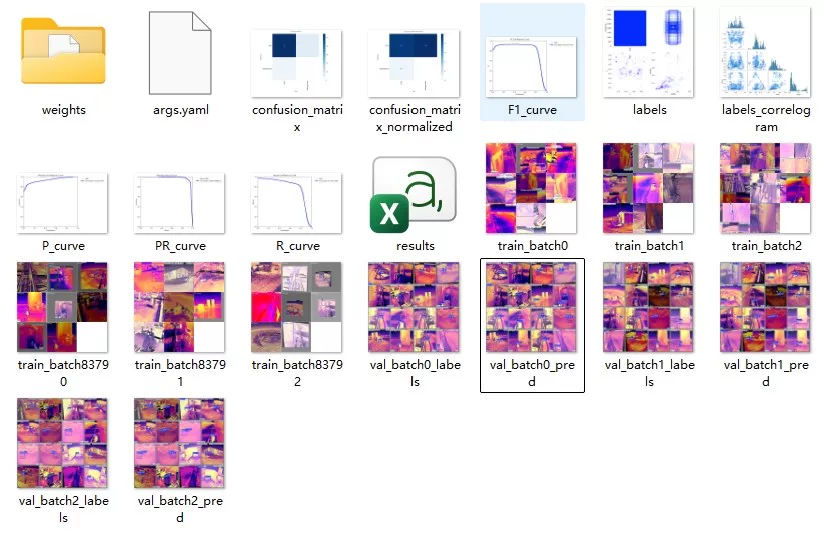
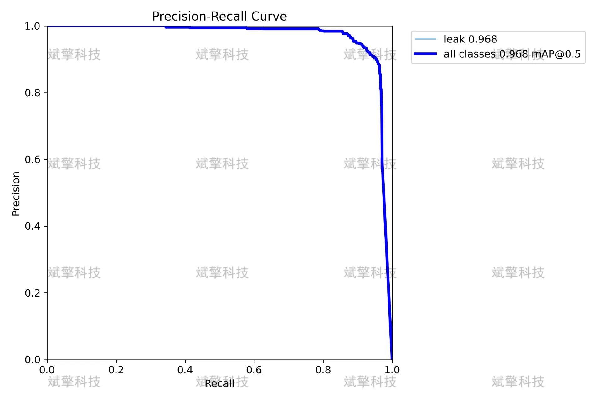

# YOLOv11 Substation Leakage Detection System

## Body

The YOLOv11 substation leak detection system is based on the YOLOv11 deep learning. The system uses the YOLOv11+YOLO dataset, UI interface, login and registration interface, Python project source code, and model to detect liquid leaks in substations.

As the power system rapidly develops, substations, as the core nodes of the power grid, are crucial for their safe and stable operation. The liquid leakage (such as insulating oil and cooling fluid) of key equipment like transformers, insulators, and oil pipelines is a common potential hazard in substations. If not detected and dealt with in time, it may lead to decreased insulation performance, overheating of equipment, or even serious power outages. Traditional manual inspection methods are inefficient and lack real-time capabilities, making it difficult to detect subtle leaks under complex conditions.
The purpose of this project is to develop an infrared detection system for substation liquid leakage based on the YOLOv11 deep learning model. By utilizing the non-photometric characteristics of infrared thermography that can capture temperature differences clearly, combined with the outstanding performance of YOLOv11 in object detection, we aim to achieve intelligent recognition and real-time warning of leakage areas in substation equipment.

Project Functionality Display

✅ User Login and Signup: Supports password detection and security verification.

✅ Three detection modes: based on the YOLOv11 model, support image, video and real-time camera three detection, accurate recognition of targets.

✅ Dual-screen comparison: Display the original image and the detection result on the same screen.

✅ Data Visualization: Real-time table display of detection target categories, confidence and coordinates.

✅ Intelligent Parameter Tuning: Offers a confidence slide, dynamically optimizes detection accuracy to meet different scene requirements.

✅ Sci-fi style interactive interface: dark theme combined with dynamic light effects, reducing visual fatigue and improving operational experience.

✅ High-performance multi-thread architecture: independent detection of threads ensures smooth operation, real-time status prompts, and rapid response without lag.

Dataset Overview

Training set: 3524 images
Validation set: 504 images
Test set: 1007 images

## Images

## Payment

Here is a pay link on Stripe ( https://buy.stripe.com/3cs8yP7sY87d0vu9AB ). Please contact me lonlonago@foxmail.com after funding $89, and I will send you a complete data files , thank you!

